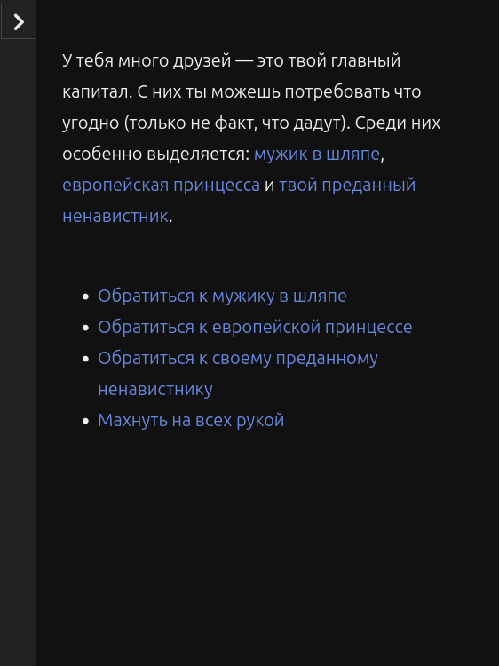
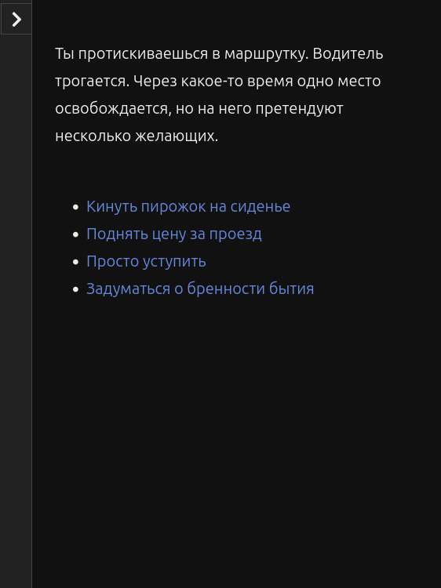
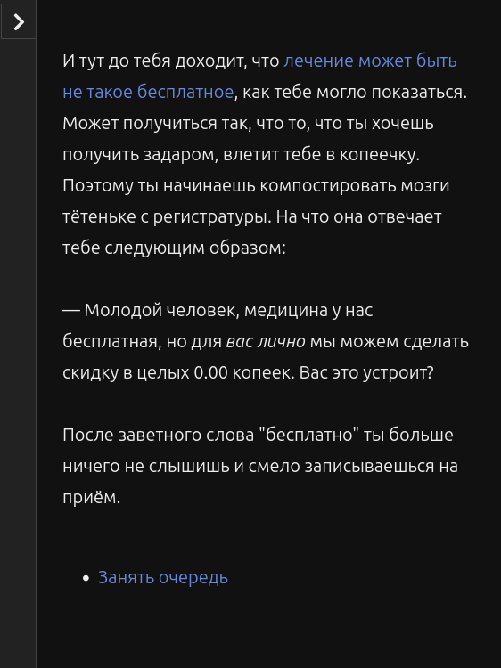

# Оформление

По-идеи, [сайт ЗОКи](https://zok.cx/) поддерживает Markdown. Но я не знаю, как дела обстоят с заголовками. Попробую.

## Аннотация

Про некого Павла Петрова, который отправился в психдиспансер, чтобы раздобыть себе немного *этого*.

## Продолжительность

Игра небольшая, много времени не отнимет: ~15мин уйдет на одну из концовок; ~35мин — на прохождение всех 4 концовок.

## Особенности игры

Несмотря на малый размер и шутливую форму, в игре можно:

* отыгрывать бессмысленного и беспощадного капиталиста (будто другие бывают);
* пускать слюни в любой непонятной ситуации;
* использовать пирожок не по назначению;
* спорить в этих ваших тырнетах и торжественно выходить победителем;
* отомстить ятолькоспросильщику;
* заговорить зубы бабуле в очереди на приём врачу;
* сражаться за место в маршрутке;
* выяснить, чего ж ты хочешь от этой жизни;
* и многое, многое другое!

## Системные требования

Любая ОСь, на которой идет веб-браузер.

## Скриншоты

* 
* 
* 
